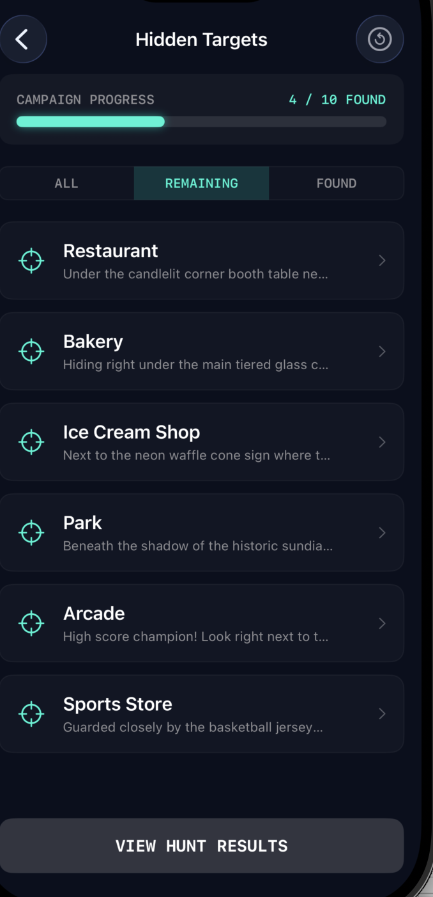
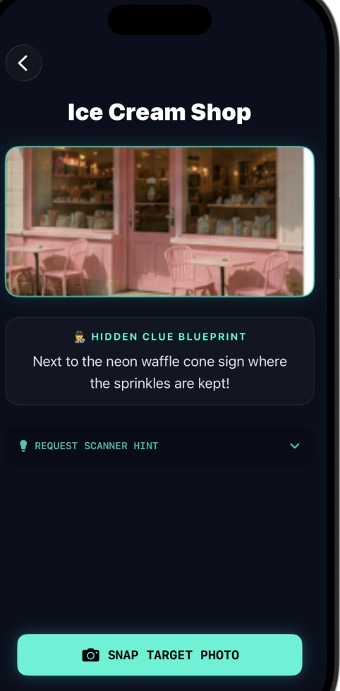

# Chamber Quest: Chamber of Commerce Scavenger Hunt Edition

Course Code: MWD3A (iOS Development)
Assignment: iosApp4
Platform: iOS 17+ (SwiftUI)
Author: Wubit
Date:June 11, 2026


#  Project Overview

Developed for the local Chamber of Commerce, this scavenger hunt application promotes local businesses by encouraging residents to explore their community through an interactive city-wide adventure.

Players search for hidden items located across local venues such as bakeries, bookstores, restaurants, and entertainment locations. Clues guide participants toward each destination, and successful discoveries unlock rewards and discounts from participating businesses.

The application demonstrates SwiftUI navigation, state management, dynamic filtering, reusable views, and interactive user experiences while supporting local business engagement.


# Technical Architecture & Project Scaffolding

```text
ScavengerHunt/
└── ScavengerHunt/
    ├── Models/
    │   ├── HuntItem.swift
    │   └── RewardManager.swift
    │
    ├── Resources/
    │   └── HuntData.swift
    │
    ├── Views/
    │   ├── ClueListView.swift
    │   ├── DetailView.swift
    │   ├── HomeView.swift
    │   ├── ResultsView.swift
    │   └── SplashView.swift
    │
    ├── Assets.xcassets
    ├── ContentView.swift
    ├── ScavengerHuntApp.swift
    └── Utils.swift
```

## Application Flow

```text
SplashView
    ↓
HomeView
    ↓
ClueListView
    ↓
DetailView
    ↓
ResultsView
```


#  Features

* Animated splash screen
* Interactive scavenger hunt experience
* Dynamic progress tracking
* Hidden and found target filtering
* Detail screens with clues and hints
* Camera capture simulation
* Reward calculation system
* Chamber of Commerce discount rewards
* SwiftUI navigation architecture
* Observable state management


# Screenshots

### Onboarding Home Screen (0 Found: Novice Explorer)


### Progress Tracker Home Screen (5 Found: Expert Tracker)


### Clue List Screen (ALL View)


### Clue List Screen (Hidden Targets)



### Clue List Screen (FOUND Filter Active)


### Target Detail Screen: Bakery


### Target Detail Screen: Ice Cream Shop



### Reward Results Screen


# 🛠 Technologies Used

* Swift
* SwiftUI
* Xcode
* NavigationStack
* ObservableObject
* State Management
* Git & GitHub


# Learning Outcomes

This project demonstrates:

* SwiftUI view composition
* State-driven UI updates
* Navigation between multiple screens
* Dynamic filtering and list rendering
* Reusable component design
* Local data management
* User experience design principles
* GitHub version control workflow


# Author

**Wubit**

Computer Networking & Cybersecurity Engineering Graduate
Mobile Application Development Student
Cybersecurity Enthusiast | SwiftUI Developer | AI & Security Advocate
