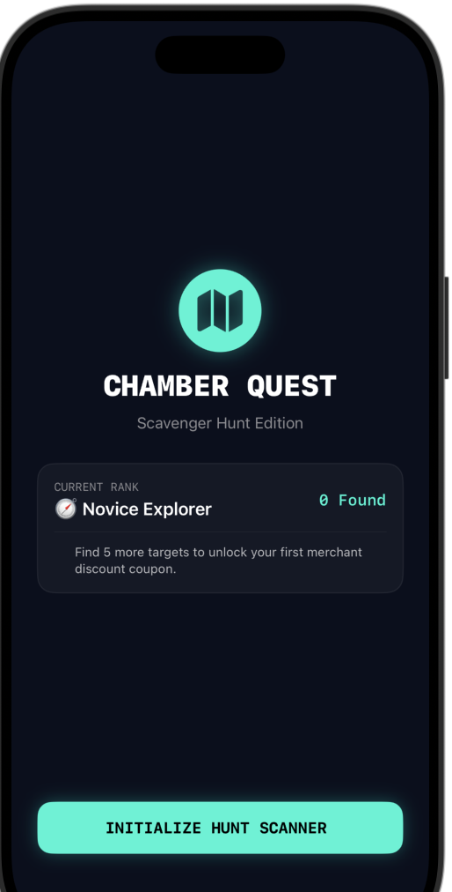
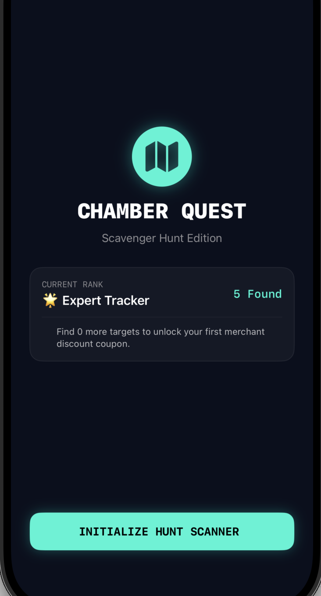
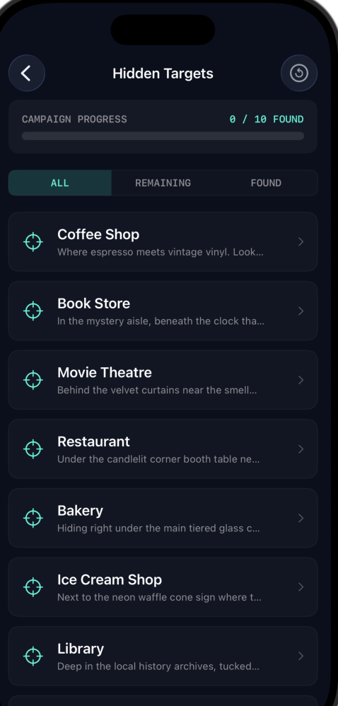
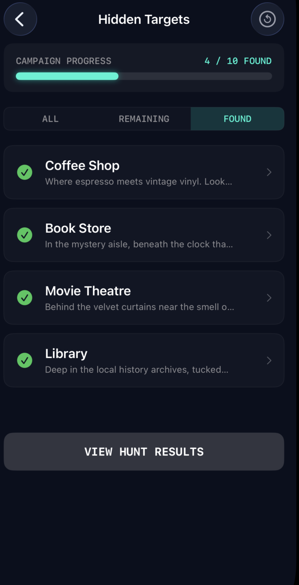
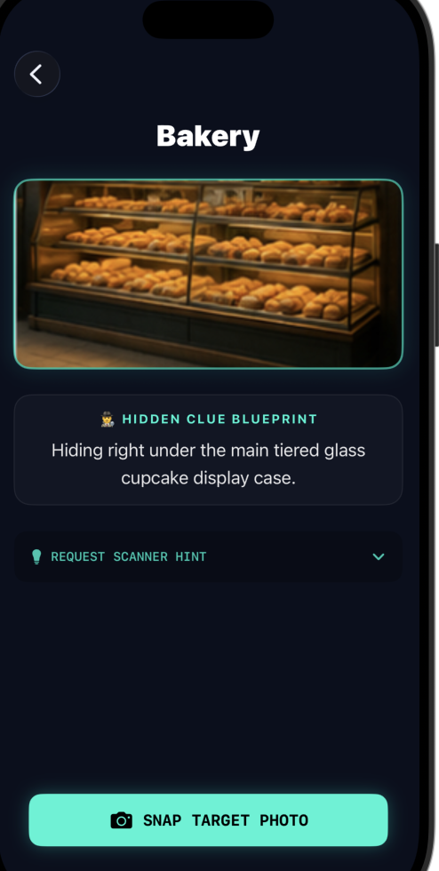

# 🧭 Chamber Quest: Chamber of Commerce Scavenger Hunt Edition

Course Code: MWD3A (iOS Development)  
Assignment: Assignment 4 – Final Production Optimization & Polishing Run  
Platform: iOS  17+ (SwiftUI)  
Author: Wubit   
Date: June 11, 2026

---

# 📝 Project Overview

Developed for the local Chamber of Commerce, this production-grade Scavenger Hunt application is designed to promote local businesses (restaurants, movie theatres, bookstores, etc.) by engaging residents in an interactive city-wide discovery loop. The app highlights 10 hidden items across various local venues, offering architectural clues to guide participants. 

Using core concepts explored in the *Cards* tutorial—including complex view hierarchies, declarative data state iteration, dynamic list rendering, and asset processing—the app implements an interactive camera simulation to track progress, updates state engines natively across multiple separate windows, and dynamically awards tier-based commercial discounts based on real-time performance.

---

# 🏗️ Technical Architecture & Project Scaffolding

This workspace strictly conforms to the production file organization hierarchy visible in your Xcode navigation layout, completely decoupling data architecture models from declarative subview layers:

```text
ScavengerHunt/                              # Main Project Root Directory Node
└── ScavengerHunt/                          # Inner Workspace Application Target Core Folder
    ├── Models/                             # Data structural blueprints & logical schema definitions
    │   ├── HuntItem.swift                  # Core target tracking business data model blueprint
    │   └── RewardManager.swift             # Central state management repository and observable engine
    │
    ├── Resources/                          # Project asset configurations and static data assets
    │   └── HuntData.swift                  # Seed data store managing structural regional business profiles
    │
    ├── Views/                              # Modular UI layout hierarchy (SwiftUI Declarative Canvas views)
    │   ├── ClueListView.swift              # Master roster view featuring dynamic segmented rows and filter controls
    │   ├── DetailView.swift                # Granular asset inspection screen featuring expandable hint drawers
    │   ├── HomeView.swift                  # Main landing hub incorporating reactive player ranking metrics
    │   ├── ResultsView.swift               # Final evaluation dashboard with state-driven barcode claim logic
    │   └── SplashView.swift                # Animated intro screen featuring auto-delay animation dispatchers
    │
    ├── Assets.xcassets                     # Global imagery catalog, dynamic color spaces, and app icons
    ├── ContentView.swift                   # Underlying root controller layout container
    ├── ScavengerHuntApp.swift              # Main application execution entry point & environment injection
    └── Utils.swift                         # Math hexadecimal color extensions & background thread handlers


    +---------------------------------------------+
       |               SplashView.swift              |
       |  - Animated Branding Pulse Logo Animation   |
    |  - Automated 2.5s Thread Routing Dispatcher |
       +----------------------+----------------------+
                              |
                              ▼
       +---------------------------------------------+
       |                HomeView.swift               |
       |  - Reactive Player Rank / Badge Statistics |
       |  - Navigation Router Action Launch Button   |
       +----------------------+----------------------+
                              |
                              ▼
       +---------------------------------------------+
       |              ClueListView.swift             |
       |  - 3-Way Segment Filter Control Tab Header  |
       |  - Reactive Neon Tracker Bar (Safe-Scroll)  |
       +----------------------+----------------------+
                              |
                              ▼
       +---------------------------------------------+
       |               DetailView.swift              |
       |  - Expandable Accordion Hint Disclosure     |
       |  - Snap Camera Shutter Validation Simulator |
       +----------------------+----------------------+
                              |
                              ▼
       +---------------------------------------------+
       |               ResultsView.swift             |
       |  - Multi-Tier Conditional Logic Calculator  |
       |  - Wallet Activation Toggle & Barcode Layer |
       +---------------------------------------------+


       ### Onboarding Home Screen (0 Found: Novice Explorer)


### Progress Tracker Home Screen (5 Found: Expert Tracker)


### Clue List Screen (ALL View)


### Clue List Screen (REMAINING Filter Active)


### Clue List Screen (FOUND Filter Active)


### Target Detail Screen: Bakery


### Target Detail Screen: Ice Cream Shop


### Reward Results Screen
